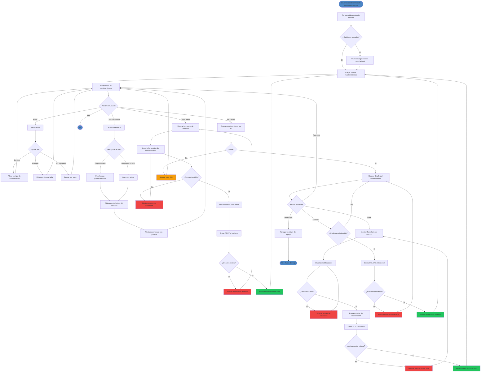

# Diagrama de Actividades - Módulo de Mantenimientos

## Descripción
Este diagrama muestra el flujo de actividades para el módulo de gestión de mantenimientos de equipos del sistema Hospital San Rafael.

## Diagrama en formato Mermaid



## Descripción de Actividades Principales

### 1. Cargar Módulo
- El usuario accede al módulo de mantenimientos
- Se cargan automáticamente los catálogos (tipos de mantenimiento y tipos de falla)
- Se muestra la lista de mantenimientos

### 2. Filtrar Mantenimientos
- **Por tipo de mantenimiento**: Correctivo, Preventivo, Predictivo, Otro
- **Por tipo de falla**: Desgaste, Operación Indebida, Causa Externa, etc.
- **Por búsqueda**: Texto libre en múltiples campos

### 3. Ver Dashboard
- Muestra estadísticas de mantenimientos
- Permite seleccionar rango de fechas
- Por defecto muestra el mes actual
- Incluye gráficos y contadores

### 4. Crear Mantenimiento
**Campos principales:**
- Número de reporte
- Fecha y horas (llamado, inicio, terminación)
- Tipo de mantenimiento
- Tipo de falla
- Equipo asociado
- Actividades realizadas
- Observaciones
- Técnico responsable

**Validaciones:**
- Campos requeridos
- Formatos de fecha y hora
- Relación con equipo existente

### 5. Editar Mantenimiento
- Cargar datos existentes
- Permitir modificación
- Validar cambios
- Actualizar en base de datos

### 6. Eliminar Mantenimiento
- Solicitar confirmación
- Eliminar de base de datos
- Actualizar lista

### 7. Ver Detalle
- Mostrar información completa
- Ver equipo asociado
- Acceso a edición y eliminación

## Roles y Permisos
- **Administrador**: Acceso completo (crear, editar, eliminar, ver)
- **Supervisor**: Puede ver y editar, no eliminar
- **Técnico**: Solo puede ver y crear

## Notificaciones
- **Éxito**: Verde - Operación completada
- **Error**: Rojo - Operación fallida
- **Advertencia**: Naranja - Validaciones o confirmaciones
- **Info**: Azul - Información general

## Endpoints del Backend

### GET
- `GET /api/sysmantenimiento` - Listar todos con filtros
- `GET /api/sysmantenimiento/:id` - Obtener por ID
- `GET /api/sysmantenimiento/equipo/:idEquipo` - Por equipo
- `GET /api/sysmantenimiento/dashboard` - Estadísticas

### POST
- `POST /api/sysmantenimiento` - Crear nuevo

### PUT
- `PUT /api/sysmantenimiento/:id` - Actualizar

### DELETE
- `DELETE /api/sysmantenimiento/:id` - Eliminar

## Estados del Componente

```typescript
// Estados principales
isLoading: boolean       // Indicador de carga
error: string | null     // Mensaje de error
mantenimientos: []       // Lista de mantenimientos
filteredMantenimientos:  // Lista filtrada
selectedTipo: number     // Filtro por tipo
selectedFalla: number    // Filtro por falla
searchTerm: string       // Término de búsqueda
```

## Flujo de Datos

```
Frontend Component
    ↓
MantenimientosService
    ↓
HTTP Request
    ↓
Backend API
    ↓
SysMantenimientoController
    ↓
SysMantenimientoService
    ↓
Sequelize Model
    ↓
Base de Datos
```

---

**Generado para**: Hospital San Rafael - Sistema de Gestión de Mantenimientos
**Fecha**: Diciembre 2025
**Versión**: 1.0
